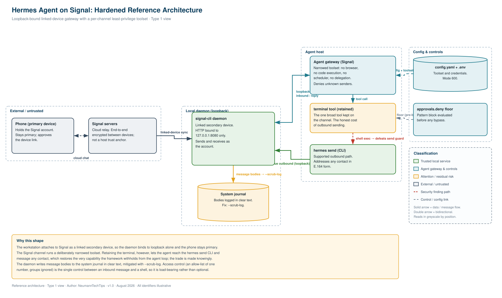

# 🛰️ Hardening a Self-Hosted AI Agent on Signal

> A practitioner's build note on bridging the **Nous Research Hermes Agent** to **Signal** over `signal-cli`, driving authenticated outbound messaging, and reducing the inbound attack surface to a defensible least-privilege posture.

[](#)
[](#)
[](#)
[](#)
[](#)
[](#)

Author: **[NeumannTechTips](https://github.com/NeumannTechTips)** · Reviewed: August 2026

`#Signal` `#signal-cli` `#CyberSecurity` `#AIAgents` `#HermesAgent` `#LeastPrivilege` `#PromptInjection` `#OWASPTop10` `#SelfHosted` `#DevSecOps` `#PrivacyByDesign` `#ThreatModelling` `#journald` `#InfoSec`

---

## 📖 Table of contents

- [Why this exists](#-why-this-exists)
- [What you get](#-what-you-get)
- [Architecture at a glance](#-architecture-at-a-glance)
- [Threat model in brief](#-threat-model-in-brief)
- [Before you start](#-before-you-start)
- [Part 1: Stand up the Signal link](#-part-1-stand-up-the-signal-link)
- [Part 2: Authenticated outbound messaging](#-part-2-authenticated-outbound-messaging)
- [Part 3: Harden the channel](#-part-3-harden-the-channel)
- [Verification](#-verification)
- [Security findings](#-security-findings)
- [Troubleshooting](#-troubleshooting)
- [Lessons learned](#-lessons-learned)
- [Reference](#-reference)
- [Topics](#-topics)
- [Licence](#-licence)

---

## 🤔 Why this exists

Attaching a chat transport to an autonomous agent is a five-minute task. Doing it without opening a remote-code-execution path onto the host is not. The upstream quick-start links the account and moves on; it does not tell you that an inbound message now lands in the context of a process that reads your home directory, holds your model weights, and can drive a shell. In <abbr title="Open Worldwide Application Security Project: the body that publishes the Top 10 lists for web and, now, agentic-AI risks">OWASP</abbr> terms this is textbook **excessive agency** married to an untrusted input surface.

This note documents a build that treats the inbound path as the primary control problem rather than an afterthought. It records what works, corrects two points in the upstream documentation that will otherwise cost you an evening, and states the security decisions plainly enough that you could defend them at a review board.

> 💡 **Tooltip :** an AI agent that can run commands on your computer is powerful and risky. If a stranger can message it, they might be able to make it run those commands. This guide is about closing that door while keeping the useful part.

The reference host is a Fedora KDE workstation running a locally hosted agent against a local model. The controls generalise to any comparable deployment.

### Key outcomes

- ✅ Authenticated outbound messaging to any contact, addressed in <abbr title="E.164 is the international phone-number format: a plus sign, country code, then the number, with no spaces">E.164</abbr> form
- ✅ No third-party desktop client and no bespoke connector code in the trust path
- ✅ The Signal adapter runs an explicit least-privilege toolset rather than the default full-access profile
- ✅ Every control is reversible, evidenced against source, and greyscale-legible in the architecture view
- ✅ The clear-text logging exposure in the default posture is identified and remediated

---

## 📦 What you get

| Capability | Status | Notes |
|---|---|---|
| Outbound to an arbitrary contact | ✅ Stable | Single first-party command, E.164 addressing, recipient resolved via `listContacts` |
| Inbound from an allow-listed principal | ✅ Stable | Deny-by-default; unknown senders require explicit pairing |
| Per-adapter toolset restriction | ✅ Stable | Verified against the framework's own resolver, not self-reported |
| Clear-text log remediation | ⚠️ Manual | One daemon flag; verify residue afterwards |
| Name-based addressing | 🚧 Deferred | Requires a reviewed contact map; PII trade-off, see closing notes |

---

## 🗺️ Architecture at a glance

The agent never speaks the Signal protocol directly. It drives a local `signal-cli` daemon over a JSON interface bound to the loopback interface, and that daemon attaches to your account as a **linked secondary device** under the Sesame session model. The phone remains the primary registration throughout.

<p align="center">
  
</p>

> Reference architecture, Type 1 view. Stroke colour classifies each component, and the classification is spelled out in the legend, so the diagram still reads in greyscale. All identifiers shown are illustrative.

> 💡 **Tooltip :** think of `signal-cli` as a second device on your Signal account, like a linked desktop app, but headless. The agent talks to it only over a private internal channel that never leaves the machine.

Three properties of the linked-device model drive the decisions that follow:

- A Java runtime is mandatory, because `signal-cli` is a JVM application.
- The daemon is a long-lived service with a lifecycle independent of the agent gateway, so it belongs under a supervised `systemd` user unit.
- Because the workstation binds to your own identity rather than a segregated bot principal, it inherits full read and send authority over your account. That is precisely the capability you want and precisely the blast radius you must contain, which is why the inbound access control is load-bearing rather than cosmetic.

---

## 🎯 Threat model in brief

A compact model, mapped to recognised categories so it travels:

| Ref | Threat | Vector | Control |
|---|---|---|---|
| T1 | Inbound RCE | Untrusted message reaches a shell-capable agent | Deny-by-default allow-list; least-privilege toolset |
| T2 | Prompt injection | Adversarial text or fetched content steers the agent | Remove browser and web-fetch tools from the adapter |
| T3 | Credential exfiltration | Agent reads `.env` and sends the token out its own channel | `approvals.deny` glob on secret paths; file mode 600 |
| T4 | Data egress | Message bodies and attachments carry content off-host | Tool-layer restriction; the transport itself is unbounded |
| T5 | Data-at-rest disclosure | Daemon logs clear-text bodies to the journal | `--scrub-log`; journald retention limits |

> 💡 **Tooltip :** <abbr title="Remote Code Execution: an attacker getting your machine to run their commands from afar">RCE</abbr> is the worst case, someone running commands on your box remotely. <abbr title="Prompt injection: hiding instructions inside content the AI reads, so it obeys the attacker instead of you">Prompt injection</abbr> is subtler, hiding instructions inside a message so the agent follows them. The controls on the right are how each is blunted.

---

## 🧰 Before you start

| Requirement | Rationale |
|---|---|
| A current `signal-cli` release | Provides the linked-device transport and the JSON-RPC surface |
| A modern JDK | Recent `signal-cli` pins an up-to-date Java; an older JVM fails at start-up rather than degrading |
| Your phone with Signal installed | Device linking is confirmed by scanning a QR code on the primary |
| Shell access to the host | Every step here is a local, auditable command |
| A verified config backup | Establishes a known-good rollback point before any mutation |

> ⚠️ **Verify the Java version against the `signal-cli` release notes, not an older blog.** The pin advances with releases; a JVM one major version behind throws a start-up exception that reads like a network fault and wastes an evening.

---

## 🔗 Part 1: Stand up the Signal link

### 1. Provision the runtime and client

Install a current headless JDK and a terminal QR encoder, pull the `signal-cli` release, verify its published checksum, and unpack it to a system path with a stable symlink.

### 2. Link the device

Linking enrols the workstation as a secondary device. It is externally visible, it appears under **Linked Devices** on the primary, and it is revocable only from the phone. Treat it as a deliberate, gated action.

```bash
signal-cli link -n "AgentHost-Workstation"
# Render the printed tsdevice: URI as a QR code, then scan from
# Signal > Settings > Linked Devices > Link New Device
```

> ⚠️ **Link, never register.** `link` enrols a secondary device under your existing identity. `register` claims a number as a fresh primary and will deregister your handset. Only `link` is correct here.

> 💡 **Tooltip :** linking is like pairing Signal Desktop. Registering is like moving your number to a new phone, which kicks the old one off. You want the first, never the second.

Pull initial state and confirm enrolment:

```bash
signal-cli listAccounts
```

### 3. Supervise the daemon as a user unit

Author the unit yourself and bind the HTTP surface to loopback explicitly. `--scrub-log` is set here as a default, closing finding T5 before the daemon ever writes.

```ini
[Unit]
Description=signal-cli daemon for the agent host
After=network-online.target
Wants=network-online.target

[Service]
Type=simple
Environment=SIGNAL_CLI_ACCOUNT=+15550000000
ExecStart=/usr/local/bin/signal-cli -a ${SIGNAL_CLI_ACCOUNT} daemon --http 127.0.0.1:8080 --scrub-log
Restart=on-failure
RestartSec=5
NoNewPrivileges=true
PrivateTmp=true

[Install]
WantedBy=default.target
```

Enable it, then assert the bind address. This check is not optional.

```bash
systemctl --user enable --now signal-cli.service
ss -ltnp | grep 8080     # expect 127.0.0.1:8080, never 0.0.0.0:8080
```

> ⚠️ **An unauthenticated JSON-RPC endpoint that can send as you must never bind to a routable interface.** A `0.0.0.0` bind is a critical misconfiguration: stop the service and correct the `--http` argument before proceeding.

> 💡 **Tooltip :** `127.0.0.1` means "this machine only". If you ever see `0.0.0.0`, the service is listening to the whole network, which would let others on your Wi-Fi send messages as you. Fix it immediately.

### 4. Bind the adapter and scope access

Set the adapter keys, then constrain the allow-list to your own principal and leave group access unset. Deny-by-default is the correct failure mode; preserve it.

```bash
SIGNAL_HTTP_URL=http://127.0.0.1:8080
SIGNAL_ACCOUNT=+15550000000
SIGNAL_ALLOWED_USERS=+15550000000
# Group access deliberately omitted (groups ignored).
# GATEWAY_ALLOW_ALL_USERS must never be set on this host.
```

```bash
chmod 600 ~/.hermes/.env
```

Unknown senders are refused until you issue a pairing approval, which keeps the trust boundary an explicit, human-gated act.

---

## ✉️ Part 2: Authenticated outbound messaging

A design point worth internalising before you reach for custom code: **outbound messaging ships with Hermes and sits deliberately outside the agent loop.** The model is not granted an agent-callable `send_message` tool; delivery is handled by first-party paths (`hermes send`, cron delivery, the gateway notifier). The supported command is a one-liner.

```bash
hermes send --to signal:+<E164 number> "message body"
```

Worked example with an illustrative number:

```bash
hermes send --to signal:+15551234567 "Dispatch from the agent host"
```

### Addressing contract

- The target is strict E.164: leading `+`, country code, digits, no separators. `+15551234567`, never `+1 555 123 4567`. A stray space forces channel-name resolution and the send fails.
- The body is a single double-quoted argument.
- A bare platform token routes to the configured home channel; an E.164 target routes to that recipient, resolved through the adapter's `listContacts` cache.

> 💡 **Tooltip :** the phone number must be written in the international format with a plus sign and no spaces, exactly like `+15551234567`. Get that right and the message just sends.

### Driving it through the agent

Because the Signal adapter retains the `terminal` tool, an instruction from your phone is executed by the agent shelling out to the same command. Constrain the instruction so a small model cannot improvise:

```
Run this exact command once, then report the command output verbatim and nothing else.

hermes send --to signal:+15551234567 "Message body here"
```

> ✅ **Supply the real number yourself and confirm delivery on the primary.** A `sent` result with exit code 0 means the CLI accepted the payload; ground truth is the message landing in the recipient thread on your handset, delivered as a sync copy from the linked device.

> 🚫 **Never leave a placeholder in the recipient field.** A malformed placeholder fails closed and is rejected. A well-formed but fabricated number does not fail closed, and would deliver to an unintended party.

---

## 🛡️ Part 3: Harden the channel

Here the default posture needs correcting. By default the Signal adapter resolves to `hermes-signal`, which is defined as `_HERMES_CORE_TOOLS`, the platform's **full-access** profile. That set includes `terminal`, `code_execution`, browser automation with Chrome DevTools Protocol access, a scheduler (`cronjob`), and task delegation, all reachable by any principal that can deliver an inbound message.

An inbound message is untrusted input. Granting it the full core toolset is functionally equivalent to exposing a shell behind a public form.

### Pin an explicit least-privilege toolset

Toolsets are configured per platform under `platform_toolsets`. Replace the inherited full-access profile on the Signal adapter with an explicit, narrower list.

```yaml
platform_toolsets:
  signal:
    - terminal
    - file
    - web
    - vision
    - skills
    - todo
    - memory
    - session_search
```

What this strips from the inbound surface, and the rationale:

| Removed | Rationale |
|---|---|
| `browser` (incl. CDP) | Eliminates the path by which untrusted fetched content reaches an unsandboxed agent (T2) |
| `code_execution` | No arbitrary code paths beyond the deliberately retained shell |
| `cronjob` | An inbound message cannot install standing, unattended egress (T4) |
| `delegation` | A single message cannot fan out into further agent runs |

`terminal` is retained by design. It is the mechanism that keeps `hermes send` reachable, and it is the honest cost of the capability: retaining it enables outbound messaging and simultaneously provides the agent a route to that command. You cannot satisfy the requirement without it in this design, so the trade is made explicitly rather than by omission.

> ℹ️ The resolver drops unknown or platform-restricted toolset names rather than trusting them, so a typo fails closed. Restart the gateway to load the change.

> 💡 **Tooltip :** you are handing the messaging channel a short, safe list of abilities instead of the full set. The one powerful ability you keep, the terminal, is the one that makes sending work, so you keep it on purpose and know the risk.

### Keep a deny floor beneath the toolset

Independently of the toolset, a pattern deny-list blocks dangerous invocations before any approval bypass is evaluated. A defensible baseline covers privilege escalation, shell piping, key material, firewall mutation, and destructive disk operations.

```yaml
approvals:
  mode: manual
  cron_mode: deny
  deny:
    - '*sudo *'
    - '*| bash*'
    - '*| sh*'
    - '*~/.ssh/*'
    - '*chmod*777*'
    - '*iptables*'
    - '*shred *'
    - '*wipefs*'
```

---

## 🔍 Verification

Do not trust the agent's self-description of its own privileges. Interrogate the framework's resolver directly, using the same function the gateway calls at dispatch.

```python
import yaml
from hermes_cli.tools_config import _get_platform_tools
cfg = yaml.safe_load(open("config.yaml"))
print("signal:", sorted(_get_platform_tools(cfg, "signal")))
print("cli:   ", sorted(_get_platform_tools(cfg, "cli")))
```

A correctly hardened Signal adapter shows `terminal` present and both the browser set and `code_execution` **absent**, while the CLI profile still lists them. If the two lines match, the restriction has not taken effect and the gateway needs a restart.

> 💡 **Tooltip :** rather than asking the agent "what can you do", you ask the program itself. That answer cannot be talked around. It is the difference between a claim and a fact.

Then run the two end-to-end checks that no log can fabricate:

1. Ask the agent over Signal to enumerate its tools, and diff against the resolver output.
2. Send to a consenting contact and confirm arrival in their thread on your handset.

---

## 🚨 Security findings

Three findings are worth publishing, because each is a general pattern rather than a local quirk.

### 🔴 A vendor safety control neutralised by local configuration

Hermes deliberately withholds an agent-callable `send_message` tool; outbound delivery is kept outside the agent loop so the model cannot autonomously message anyone. It is a sound piece of design.

Retaining `terminal` on the messaging adapter neutralises it. The agent can shell out to `hermes send` and reach any recipient. The control is not bypassed by a defect; it is cancelled by a configuration choice. If you narrow the toolset yet keep the shell, you have made this trade, and you should make it consciously.

### 🟠 Clear-text message bodies persisted to `journald`

Run as a service at default verbosity, the daemon echoes received envelopes, including sender identifiers and body text, to the systemd journal. The journal enforces no disappearing-message timer, so content you set to auto-delete in Signal persists at rest in a store that ignores that setting, readable by any principal with journal access and without touching the encrypted database.

Remediate with `--scrub-log` on the unit (shown in Part 1). Verify residue afterwards, since scrubbing is documented against identifiers rather than bodies, and fall back to journald retention limits if bodies persist.

### 🟡 The narrow surface hardened, the wide one left default

It is tempting to lock down the local CLI, where untrusted content rarely arrives, and leave the messaging adapter on the full-access default, where untrusted content arrives by design. The correct priority is inverted: harden the externally reachable channel first.

> These map cleanly onto recognised agentic-security guidance around **tool misuse**, **excessive agency**, and **insecure defaults**. Treat any inbound messaging adapter as an untrusted input surface and grant it the minimum privilege that still discharges the task.

> 💡 **Tooltip :** the headline lesson is that the "safe by default" assumption was wrong here. The convenient setting was also the dangerous one, and you have to change it on purpose.

---

## 🛠️ Troubleshooting

| Symptom | Likely cause | Action |
|---|---|---|
| `Could not resolve '+...'` | Malformed recipient, usually a stray space or leftover placeholder | Re-enter in strict E.164 |
| Daemon reachable by `curl`, gateway reports unreachable | SSRF URL validation on the adapter path | Apply a narrowly scoped allowance, not a blanket change |
| `config file is in use by another instance` | A second process is contending for the account lock | Confirm only the supervised daemon is running |
| Agent claims a tool it should not have | Session is reporting a cached schema, not its live resolution | Trust the resolver output over the self-report |
| Sent but not seen | Delivery latency, and self-sends surface under Note to Self | Check the recipient thread on the handset |

---

## 🎓 Lessons learned

- **Interrogate source, not summaries.** At several points the config file, the agent's self-report, and the resolver disagreed. Only the resolver, the framework's own code path, was authoritative. When an agent reports success, verify the artefact rather than the narrative.
- **Atomic instructions beat open goals with a small model.** A single fully specified command executed correctly; a broad objective was improvised and misreported. Specify the command, constrain the output, confirm the result.
- **A capable-looking build can be documentation drift.** Config described a plan already largely executed, in a different order than recorded. Reconcile the record against the running system before trusting either.
- **The guard rail and the feature are often one lever.** Retaining the shell both enables sending and defeats the vendor control. Name that trade openly rather than discovering it in an incident review.

---

## 📚 Reference

- Nous Research Hermes Agent, messaging gateway and Signal adapter documentation
- `signal-cli`, installation, device linking, and the JSON-RPC interface
- OWASP Top 10 for Agentic Applications, tool misuse and excessive agency
- NIST AI Risk Management Framework
- ISO/IEC 42001, AI management systems
- GDPR Article 25, data protection by design and by default

> All identifiers, phone numbers, account references, and hostnames in this document are illustrative. Replace them with your own before use.

---

## 🏷️ Topics

`#Signal` `#signal-cli` `#CyberSecurity` `#InfoSec` `#AIAgents` `#HermesAgent` `#NousResearch` `#LeastPrivilege` `#ZeroTrust` `#PromptInjection` `#OWASPTop10` `#AgenticAI` `#SelfHosted` `#DevSecOps` `#PrivacyByDesign` `#ThreatModelling` `#journald` `#Fedora` `#SystemHardening` `#E2EE`

---

## 📄 Licence

Released under the MIT Licence. See `LICENSE` for details.

---

<div align="center">

**Built and documented by [NeumannTechTips](https://github.com/NeumannTechTips)**

If this saved you an evening, a ⭐ is appreciated.

</div>
